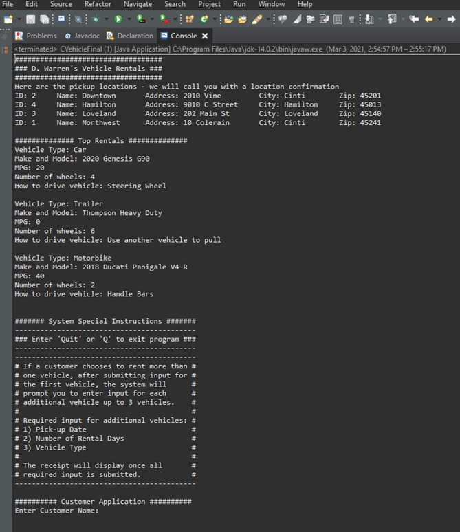
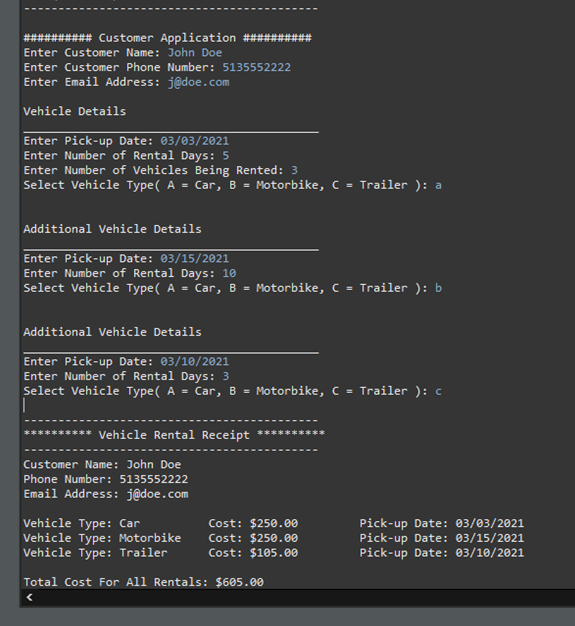

# Vehicle Rental Application
[Live Video Demo](https://www.youtube.com/embed/SwcHG7z2zgY)

---

## Description
This program is designed to be used as a customer application for renting vehicles.  
It is a console based program, coded using Java programming language, and created in Eclipse IDE.  
It also uses Microsoft SQL Server to script a corresponding database.  
The database, dbVehicleRental has a  table, TLocations to store the car rental pickup locations.  
All processing will take place in the Java program itself. 
 

## How To Use the Application
__Step 1:__ Run the program from class CVehicleFinal (this contains the main method).  

Screenshot:  
  

__Details of Step 1 screenshot:__  
At this point the program is displaying the four different pick-up locations for rentals.  
It also displays the current top rentals in each vehicle rental type (car, trailer, motorbike).  
Then it displays system instructions to give the user an overview of how to use the application.
 
 

__Step 2:__ Fill out required input for customer application.  

Screenshot:  

   

__Details of Step 2 screenshot:__  
At this point the user has entered in all required input for the customer,  
and the program has processed that input and calculated the total cost for the customer.

## Live Video Demo  
Click [here](https://www.youtube.com/embed/SwcHG7z2zgY) for a live demonstration of  the program.  

 

## Conclusion  
This application was created as a final project for my Java 1 Programming course in college.  
It is designed as an object-oriented program that uses different classes to run the program in the main method.    
On top of what can be seen in the screenshots, each piece of required input for the customer is validated.   
I hope you got a chance to check out the live video demonstration in the links provided.  
All the source code for the project is included in this repository.  
Thank you for your time!
